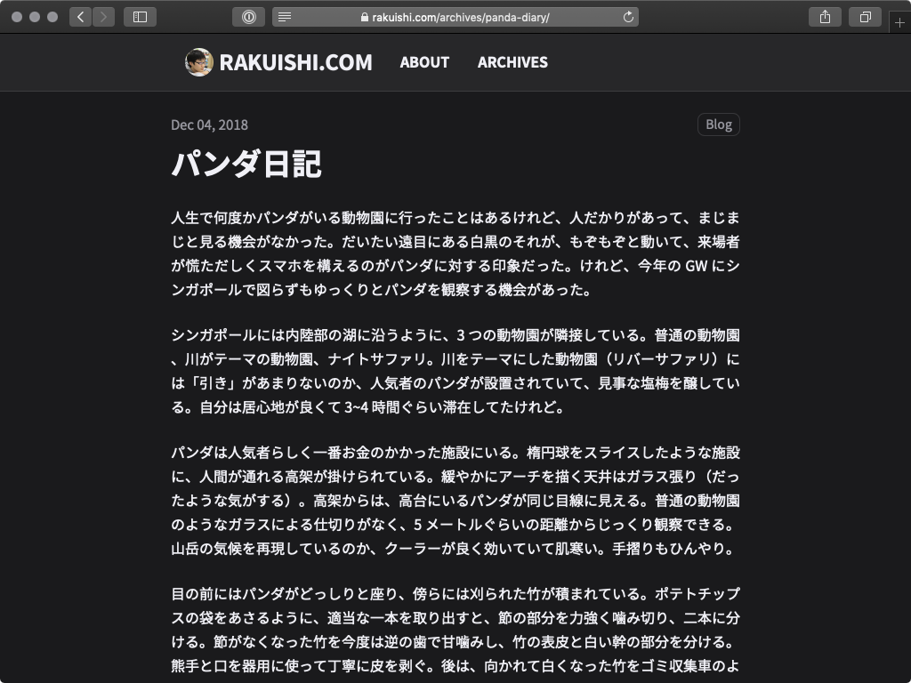
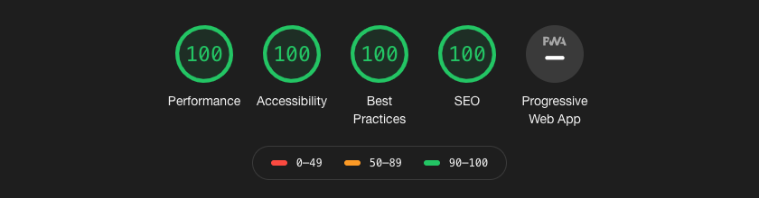

# rakuishi.com

This is the repository for the [rakuishi.com](https://rakuishi.com). This is an [Astro](https://astro.build/) project, which is a static site generator.





## Installation & Usage

```
$ npm install
$ npm run dev
```

## Slides

Convert a talk PDF into slide images and an MDX post.

```
$ brew install poppler
$ node src/pdf2slide.mjs slides/20251219_yamap-lt.pdf
```

Rules:

- Place the source PDF in `slides/` as `YYYYMMDD_event-name.pdf` (not committed); the filename minus the date prefix becomes the slug (`event-name`)
- Images are generated at `src/assets/slides/{slug}/001.webp` and rendered by `<SlideViewer slug="..." />`
- The post skeleton is generated at `src/content/posts/YYYY-MM-DD-{slug}.mdx` with a per-page transcript (existing posts are never overwritten)
- slug, date, and title are taken from the filename and PDF metadata; override with `--slug`, `--date`, `--title`
- Edit the generated title and transcript before publishing

## Deployment

```
$ brew install firebase-cli
$ firebase login
$ npm run deploy
```
